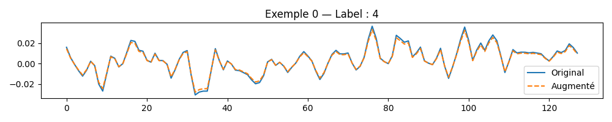
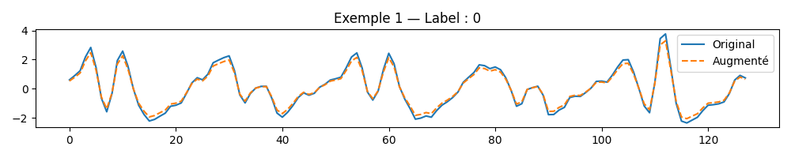

# Rapport de projet — CSC8607 : Introduction au Deep Learning

> **Consignes générales**
> - Tenez-vous au **format** et à l’**ordre** des sections ci-dessous.
> - Intégrez des **captures d’écran TensorBoard** lisibles (loss, métriques, LR finder, comparaisons).
> - Les chemins et noms de fichiers **doivent** correspondre à la structure du dépôt modèle (ex. `runs/`, `artifacts/best.ckpt`, `configs/config.yaml`).
> - Répondez aux questions **numérotées** (D1–D11, M0–M9, etc.) directement dans les sections prévues.

---

## 0) Informations générales

- **Étudiant·e** : _Nom, Prénom_
- **Projet** : _Intitulé (dataset × modèle)_
- **Dépôt Git** : _URL publique_
- **Environnement** : `python == ...`, `torch == ...`, `cuda == ...`  
- **Commandes utilisées** :
  - Entraînement : `python -m src.train --config configs/config.yaml`
  - LR finder : `python -m src.lr_finder --config configs/config.yaml`
  - Grid search : `python -m src.grid_search --config configs/config.yaml`
  - Évaluation : `python -m src.evaluate --config configs/config.yaml --checkpoint artifacts/best.ckpt`

---

## 1) Données

### 1.1 Description du dataset
- **Source** (lien) : https://archive.ics.uci.edu/dataset/240/human+activity+recognition+using+smartphones
- **Type d’entrée** (image / texte / audio / séries) : séries temporelles 1D
- **Tâche** (multiclasses, multi-label, régression) : classification multiclasses
- **Dimensions d’entrée attendues** (`meta["input_shape"]`) : (9, 128)
- **Nombre de classes** (`meta["num_classes"]`) : 6

**D1.** Quel dataset utilisez-vous ? D’où provient-il et quel est son format (dimensions, type d’entrée) ?

Le dataset utilisé est le UCI Human Activity Recognition. Il contient des séries temporelles 1D issues de capteurs (accéléromètre et gyroscope) sur 9 canaux. Chaque exemple est une séquence de 128 pas de temps. Les fichiers utilisés sont ceux du dossier Inertial Signals, qui regroupent les 9 canaux sous forme de fichiers .txt. Format des données : (N, T, C) = (nombre d'exemples, longueur temporelle, nombre de canaux) = (7352, 128, 9) pour le train, (2947, 128, 9) pour le test.

### 1.2 Splits et statistiques

| Split | #Exemples | Particularités (déséquilibre, longueur moyenne, etc.) |
|------:|----------:|--------------------------------------------------------|
| Train | 5881      |  Stratifié à partir du train initial(80%)              |
| Val   | 1471      |  Stratifié à partir du train initial(20%)              |
| Test  | 2947      |  Split officiel fourni par UCI HAR                     |

**D2.** Donnez la taille de chaque split et le nombre de classes.  

Train : 7352 exemples (avant split), dont 5881 pour l'entraînement après split 80/20

Validation : 1471 exemples

Test : 2947 exemples

Nombre de classes : 6

meta : meta = {
    "num_classes": 6,
    "input_shape": (9, 128)
}

**D3.** Si vous avez créé un split (ex. validation), expliquez **comment** (stratification, ratio, seed).

Le dataset ne fournit pas de validation. Un split stratifié a été effectué à partir du jeu d'entraînement initial (train/X_train.txt), avec un ratio 80% entraînement / 20% validation, en utilisant train_test_split() de sklearn.model_selection. La stratification a été faite sur les labels (y_train) pour conserver la distribution des classes. La seed utilisée est 42 pour garantir la reproductibilité.

**D4.** Donnez la **distribution des classes** (graphique ou tableau) et commentez en 2–3 lignes l’impact potentiel sur l’entraînement.  


La distribution des classes est relativement équilibrée. Les écarts entre classes sont modérés, avec une légère surreprésentation des classes 4 et 5 (STANDING et LAYING). Cela ne nécessite pas de pondération particulière, mais il est utile de surveiller les performances par classe lors de l’évaluation.

**D5.** Mentionnez toute particularité détectée (tailles variées, longueurs variables, multi-labels, etc.).

Le dataset UCI HAR ne présente pas de particularités problématiques :

- Les séquences ont toutes une longueur fixe de 128 pas de temps.

- Les fichiers sont bien structurés, sans valeurs manquantes.

- Chaque exemple est associé à une seule classe (classification simple, pas de multi-label).

- Les 9 canaux de capteurs sont homogènes et synchronisés.

Ces caractéristiques facilitent l’entraînement d’un modèle convolutionnel 1D sans traitement spécial ou adaptation complexe.

### 1.3 Prétraitements (preprocessing) — _appliqués à train/val/test_

Listez précisément les opérations et paramètres (valeurs **fixes**) :

- Vision : resize = __, center-crop = __, normalize = (mean=__, std=__)…
- Audio : resample = __ Hz, mel-spectrogram (n_mels=__, n_fft=__, hop_length=__), AmplitudeToDB…
- NLP : tokenizer = __, vocab = __, max_length = __, padding/truncation = __…
- Séries : normalisation par canal, fenêtrage = __…

**D6.** Quels **prétraitements** avez-vous appliqués (opérations + **paramètres exacts**) et **pourquoi** ?  

Normalisation par canal : chaque canal (accéléromètre et gyroscope) est standardisé avec une moyenne nulle et un écart-type de 1, via StandardScaler de sklearn. Cette opération est appliquée à tous les splits (train, val, test).

Reshape des données : les données sont réorganisées de (N, T, C) vers (N, C, T) pour être compatibles avec les couches Conv1d de PyTorch.

**D7.** Les prétraitements diffèrent-ils entre train/val/test (ils ne devraient pas, sauf recadrage non aléatoire en val/test) ?

Les mêmes prétraitements sont appliqués aux ensembles d’entraînement, de validation et de test. Il n’y a aucune transformation aléatoire ou spécifique à un split. Cela garantit la cohérence des données et évite toute fuite d’information ou biais d’évaluation.

### 1.4 Augmentation de données — _train uniquement_

- Liste des **augmentations** (opérations + **paramètres** et **probabilités**) :
  - ex. Flip horizontal p=0.5, RandomResizedCrop scale=__, ratio=__ …
  - Audio : time/freq masking (taille, nb masques) …
  - Séries : jitter amplitude=__, scaling=__ …

**D8.** Quelles **augmentations** avez-vous appliquées (paramètres précis) et **pourquoi** ?

Jitter : ajout de bruit gaussien de faible amplitude (σ = 0.01), appliqué avec une probabilité de 50%. Cela simule des variations naturelles dans les capteurs sans modifier le signal de manière significative.

Scaling par canal : multiplication de chaque canal par un facteur aléatoire tiré d’une loi normale centrée sur 1.0 (σ = 0.1), appliqué avec une probabilité de 50%. Cela simule des différences d’intensité ou de calibration entre capteurs.

Ces augmentations sont adaptées aux séries temporelles de capteurs, où l’activité reste reconnaissable malgré de légères variations d’amplitude ou de bruit. Elles permettent d’améliorer la robustesse du modèle sans introduire de biais.

**D9.** Les augmentations **conservent-elles les labels** ? Justifiez pour chaque transformation retenue.

Oui, les augmentations appliquées sont label-preserving. Le jitter n’altère pas la structure globale du signal, il ajoute simplement du bruit mineur. Le scaling conserve la forme du signal, seule l’amplitude change légèrement. Ces transformations ne modifient pas la classe d’activité représentée, elles sont donc sûres à utiliser pour l’entraînement.

### 1.5 Sanity-checks

- **Exemples** après preprocessing/augmentation (insérer 2–3 images/spectrogrammes) :

> _Insérer ici 2–3 captures illustrant les données après transformation._




**D10.** Montrez 2–3 exemples et commentez brièvement.

Deux exemples ont été extraits du jeu d’entraînement et affichés après prétraitement et augmentation. On observe que les signaux augmentés conservent leur forme globale, avec des variations mineures dues au jitter (bruit gaussien) et au scaling (amplitude modifiée). Cela est normal car les transformations sont aléatoires (jitter et scaling). Ces transformations respectent la structure temporelle du signal et ne modifient pas le label associé, ce qui confirme leur pertinence pour l’entraînement.

**D11.** Donnez la **forme exacte** d’un batch train (ex. `(batch, C, H, W)` ou `(batch, seq_len)`), et vérifiez la cohérence avec `meta["input_shape"]`.

La forme d’un batch est (batch_size, canaux, longueur) = (64, 9, 128). Cela correspond exactement à meta["input_shape"] = (9, 128), ce qui confirme la cohérence entre les données et le modèle. Le DataLoader d’entraînement utilise bien shuffle=True, tandis que ceux de validation et test ne shufflent pas les données.

---

## 2) Modèle

### 2.1 Baselines

**M0.**
- **Classe majoritaire** — Métrique : `Accuracy, F1-macro` → score = `0.1822, 0.0514`
- **Prédiction aléatoire uniforme** — Métrique : `Accuracy, F1-macro` → score = `0.1667 ± 0.0069, 0.1664 ± 0.0070`  

_Commentez en 2 lignes ce que ces chiffres impliquent._

Ces résultats définissent un plancher de performance que le modèle doit dépasser dès les premiers essais. Le F1-macro très faible pour la classe majoritaire montre que cette stratégie est biaisée et ne respecte pas les classes minoritaires.

### 2.2 Architecture implémentée

- **Description couche par couche** (ordre exact, tailles, activations, normalisations, poolings, résiduels, etc.) :
  - Input → (batch_size, 9, 128)
  - Couche initiale :
      Conv1d(in=9, out=64, kernel=7, stride=2, padding=3)
      BatchNorm1d(64)
      ReLU
      MaxPool1d(kernel=3, stride=2, padding=1)
  - Stage 1 (répéter N₁ fois) : 
      Conv1d(64→64, kernel=3, padding=1)
      BatchNorm1d(64)
      ReLU
      Conv1d(64→64, kernel=3, padding=1)
      BatchNorm1d(64)
      Addition résiduelle
      ReLU
  - Stage 2 (répéter N₂ fois) : 
      Premier bloc : stride=2, 64→128
      Blocs suivants : stride=1, 128→128
      Même structure que Stage 1 avec projection 1×1 si nécessaire
  - Stage 3 (répéter N₃ fois) : 
      Premier bloc : stride=2, 128→256
      Blocs suivants : stride=1, 256→256
      Même structure que Stage 2
  - Tête (GAP / linéaire) → logits (dimension = nb classes) :
      Global Average Pooling 1D
      Linear(256 → 6)

- **Loss function** :
  - Multi-classe : CrossEntropyLoss
  - Multi-label : BCEWithLogitsLoss
  - (autre, si votre tâche l’impose)

- **Sortie du modèle** : forme = __(batch_size, num_classes)__ : (32, 6)
- **Nombre total de paramètres** : `443,782`

**M1.** Décrivez l’**architecture** complète et donnez le **nombre total de paramètres**.  
Expliquez le rôle des **2 hyperparamètres spécifiques au modèle** (ceux imposés par votre sujet).

L'architecture implémentée est un CNN1D résiduel adapté aux signaux temporels multi-canaux. Le modèle contient 443,782 paramètres entraînables, ce qui est raisonnable pour cette tâche. Les deux hyperparamètres spécifiques sont :

- Taille du noyau des convolutions (kernel_size) : {3 ou 5} - ce paramètre contrôle la taille de la fenêtre temporelle analysée dans chaque couche convolutive, impactant la capacité du modèle à capturer des motifs temporels plus ou moins longs.

- Nombre de blocs par stage : {(1,1,1) ou (2,2,2)} - ce paramètre définit la profondeur du réseau pour chaque résolution temporelle, influençant la capacité du modèle à apprendre des représentations hiérarchiques plus complexes.

Ces choix permettent un bon compromis entre expressivité et stabilité, tout en respectant les contraintes du projet.

### 2.3 Perte initiale & premier batch

- **Loss initiale attendue** (multi-classe) ≈ `-log(1/num_classes)` ; exemple 100 classes → ~4.61
- **Observée sur un batch** : `1.7557`
- **Vérification** : backward OK, gradients ≠ 0 (norme totale = `17.5777`)

**M2.** Donnez la **loss initiale** observée et dites si elle est cohérente. Indiquez la forme du batch et la forme de sortie du modèle.

La loss initiale observée est `1.7557`, ce qui est très proche de la valeur théorique `-log(1/6) ≈ 1.7918`. Cela confirme que les logits initiaux sont proches de zéro, donc la distribution est quasi uniforme. Le batch d’entrée a la forme `(64, 9, 128)` et les cibles `(64,)`. La sortie du modèle est `(64, 6)`, ce qui est conforme à une classification multi-classe avec 6 activités. La rétropropagation fonctionne correctement : les gradients sont non nuls.

---

## 3) Overfit « petit échantillon »

- **Sous-ensemble train** : `N = 32` exemples
- **Hyperparamètres modèle utilisés** (les 2 à régler) : `kernel_size = 3`, `num_blocks = [1, 1, 1]`
- **Optimisation** : LR = `0.001`, weight decay = `0.0` (0 ou très faible recommandé)
- **Nombre d’époques** : `10`

> _Insérer capture TensorBoard : `train/loss` montrant la descente vers ~0._

**M3.** Donnez la **taille du sous-ensemble**, les **hyperparamètres** du modèle utilisés, et la **courbe train/loss** (capture). Expliquez ce qui prouve l’overfit.

Le test d'overfit a été effectué sur un très petit sous-ensemble de 32 exemples avec les hyperparamètres kernel_size=3 et num_blocks=[1,1,1]. La courbe train/loss montre une descente rapide de 1.74 à 0.01 en seulement 10 époques, ce qui prouve que le modèle a complètement mémorisé et sur-appris ce petit ensemble d'entraînement, une capacité qui ne se généralisera pas aux données de validation. 

Comme nous pouvons le voir dans l'output :

Epoch 1: train/loss = 1.7402
Epoch 2: train/loss = 0.6875
Epoch 3: train/loss = 0.3316
Epoch 4: train/loss = 0.1891
Epoch 5: train/loss = 0.1190
Epoch 6: train/loss = 0.0767
Epoch 7: train/loss = 0.0469
Epoch 8: train/loss = 0.0270
Epoch 9: train/loss = 0.0166
Epoch 10: train/loss = 0.0115


Ce test valide que :
- Le modèle est bien implémenté
- La loss est correctement calculée
- La rétropropagation fonctionne
- Le modèle a la capacité d’apprentissage attendue

---

## 4) LR finder

- **Méthode** : balayage LR (log-scale), quelques itérations, log `(lr, loss)`
- **Fenêtre stable retenue** : `_____ → _____`
- **Choix pour la suite** :
  - **LR** = `_____`
  - **Weight decay** = `_____` (valeurs classiques : 1e-5, 1e-4)

> _Insérer capture TensorBoard : courbe LR → loss._

**M4.** Justifiez en 2–3 phrases le choix du **LR** et du **weight decay**.

---

## 5) Mini grid search (rapide)

- **Grilles** :
  - LR : `{_____ , _____ , _____}`
  - Weight decay : `{1e-5, 1e-4}`
  - Hyperparamètre modèle A : `{_____, _____}`
  - Hyperparamètre modèle B : `{_____, _____}`

- **Durée des runs** : `_____` époques par run (1–5 selon dataset), même seed

| Run (nom explicite) | LR    | WD     | Hyp-A | Hyp-B | Val metric (nom=_____) | Val loss | Notes |
|---------------------|-------|--------|-------|-------|-------------------------|----------|-------|
|                     |       |        |       |       |                         |          |       |
|                     |       |        |       |       |                         |          |       |

> _Insérer capture TensorBoard (onglet HParams/Scalars) ou tableau récapitulatif._

**M5.** Présentez la **meilleure combinaison** (selon validation) et commentez l’effet des **2 hyperparamètres de modèle** sur les courbes (stabilité, vitesse, overfit).

---

## 6) Entraînement complet (10–20 époques, sans scheduler)

- **Configuration finale** :
  - LR = `_____`
  - Weight decay = `_____`
  - Hyperparamètre modèle A = `_____`
  - Hyperparamètre modèle B = `_____`
  - Batch size = `_____`
  - Époques = `_____` (10–20)
- **Checkpoint** : `artifacts/best.ckpt` (selon meilleure métrique val)

> _Insérer captures TensorBoard :_
> - `train/loss`, `val/loss`
> - `val/accuracy` **ou** `val/f1` (classification)

**M6.** Montrez les **courbes train/val** (loss + métrique). Interprétez : sous-apprentissage / sur-apprentissage / stabilité d’entraînement.

---

## 7) Comparaisons de courbes (analyse)

> _Superposez plusieurs runs dans TensorBoard et insérez 2–3 captures :_

- **Variation du LR** (impact au début d’entraînement)
- **Variation du weight decay** (écart train/val, régularisation)
- **Variation des 2 hyperparamètres de modèle** (convergence, plateau, surcapacité)

**M7.** Trois **comparaisons** commentées (une phrase chacune) : LR, weight decay, hyperparamètres modèle — ce que vous attendiez vs. ce que vous observez.

---

## 8) Itération supplémentaire (si temps)

- **Changement(s)** : `_____` (resserrage de grille, nouvelle valeur d’un hyperparamètre, etc.)
- **Résultat** : `_____` (val metric, tendances des courbes)

**M8.** Décrivez cette itération, la motivation et le résultat.

---

## 9) Évaluation finale (test)

- **Checkpoint évalué** : `artifacts/best.ckpt`
- **Métriques test** :
  - Metric principale (nom = `_____`) : `_____`
  - Metric(s) secondaire(s) : `_____`

**M9.** Donnez les **résultats test** et comparez-les à la validation (écart raisonnable ? surapprentissage probable ?).

---

## 10) Limites, erreurs & bug diary (court)

- **Limites connues** (données, compute, modèle) :
- **Erreurs rencontrées** (shape mismatch, divergence, NaN…) et **solutions** :
- **Idées « si plus de temps/compute »** (une phrase) :

---

## 11) Reproductibilité

- **Seed** : `_____`
- **Config utilisée** : joindre un extrait de `configs/config.yaml` (sections pertinentes)
- **Commandes exactes** :

```bash
# Exemple (remplacer par vos commandes effectives)
python -m src.train --config configs/config.yaml --max_epochs 15
python -m src.evaluate --config configs/config.yaml --checkpoint artifacts/best.ckpt
````

* **Artifacts requis présents** :

  * [ ] `runs/` (runs utiles uniquement)
  * [ ] `artifacts/best.ckpt`
  * [ ] `configs/config.yaml` aligné avec la meilleure config

---

## 12) Références (courtes)

* PyTorch docs des modules utilisés (Conv2d, BatchNorm, ReLU, LSTM/GRU, transforms, etc.).
* Lien dataset officiel (et/ou HuggingFace/torchvision/torchaudio).
* Toute ressource externe substantielle (une ligne par référence).


